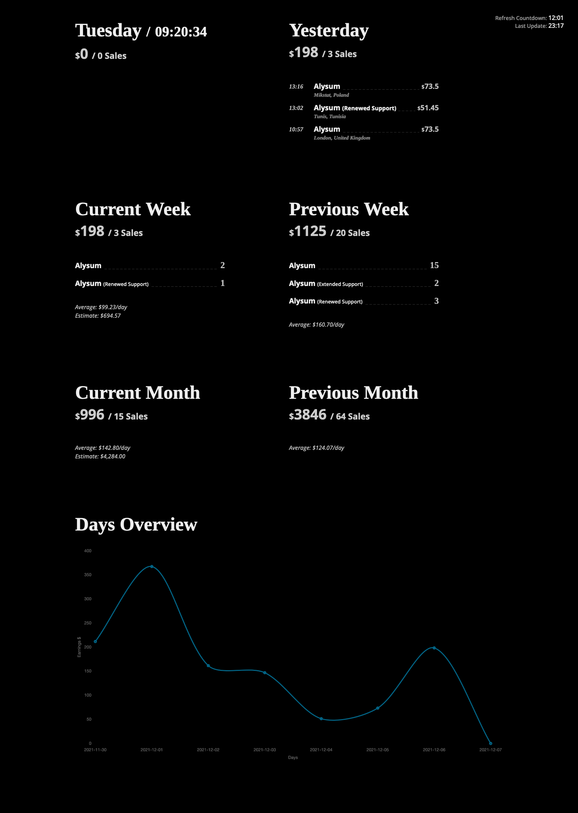

# Envato Statement

## Description

The Envato Statement is an app to display income of an Envato account. The app displays information in comparison mode, like today-yesterday, current week-previous week, and so on to give a picture of sales dynamic.

Developed using Envato.js library https://www.npmjs.com/package/envato

## Preview

## Installation

Clone app to your computer using

```bash
git clone https://github.com/promokit/envato-statement.git
```

Create .env file in the root of project and add your Envato token like this

```bash
TOKEN=5WEPQrRQXtbWF8ETspQioIDYMlHeFLrq
```

You can generate a new token at https://build.envato.com/create-token.

Installation is straight forward using NPM or Yarn:

```bash
npm install
```

To compile project just run:

```bash
npm run build
```

## App Preview


